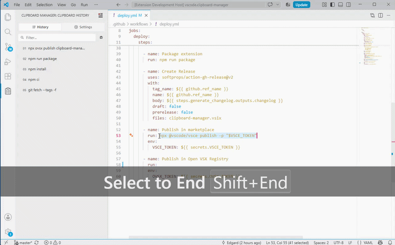
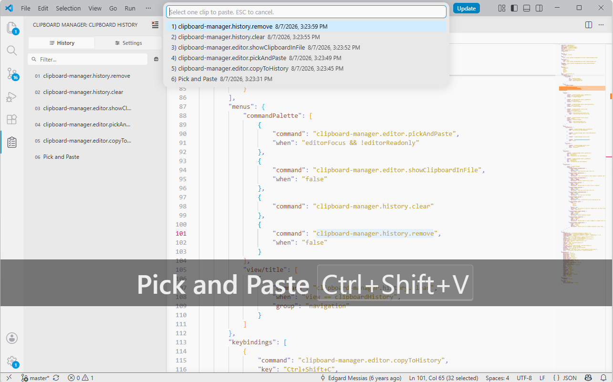
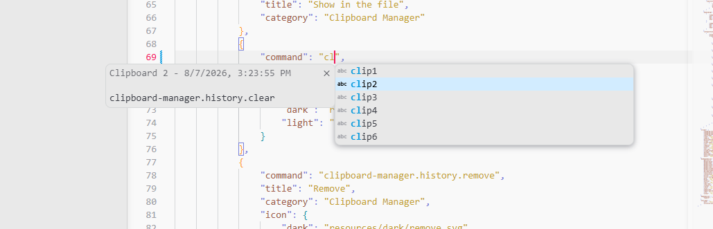
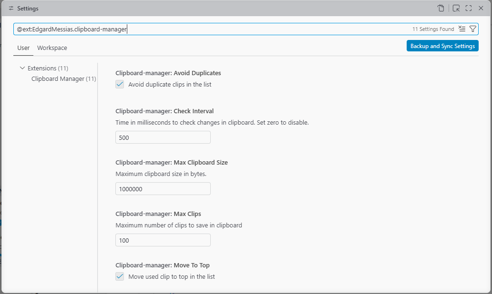
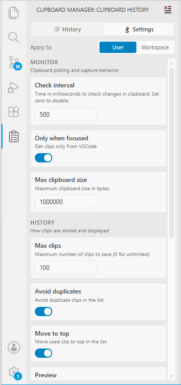

# Clipboard Manager

[](https://marketplace.visualstudio.com/items?itemName=EdgardMessias.clipboard-manager)
[](https://marketplace.visualstudio.com/items?itemName=EdgardMessias.clipboard-manager)
[](https://marketplace.visualstudio.com/items?itemName=EdgardMessias.clipboard-manager)
[](https://github.com/edgardmessias/vscode.clipboard-manager/actions/workflows/test.yml)
[](https://github.com/edgardmessias/vscode.clipboard-manager/actions/workflows/lint.yml)

Keep a searchable history of everything you copy and cut in the editor, then paste any item again **without replacing** the default `Ctrl+C` / `Ctrl+V` shortcuts.



## Table of contents

- [Features](#features)
- [Quick start](#quick-start)
- [Usage](#usage)
- [Configuration](#configuration)
- [Examples](#examples)
- [Development](#development)
- [Support](#support)

## Features

- **Clipboard history** — automatically tracks copied and cut text from the editor
- **Sidebar panel** — browse, filter, expand, and manage clips in a dedicated webview
- **Relative timestamps** — compact times like `2m` / `3h` in the list and Quick Pick (absolute time on tooltip)
- **In-panel settings** — change extension settings from the webview (user or workspace scope)
- **Pick and Paste** — quick picker with live preview in the editor (`Ctrl+Shift+V` / `Cmd+Shift+V`)
- **Hover preview** — preview a clip in the editor before confirming paste from the sidebar
- **Pause capture** — temporarily stop automatic capture; manual **Copy to Clipboard History** still works
- **Status bar** — clip count and capture state (`paused` when capture is off); click for quick actions
- **Exclude file patterns** — skip copies from files matching globs (e.g. `**/.env`, `*.pem`)
- **Ban clips** — block specific content from being captured again (hashes stored in SecretStorage, machine-local)
- **Pin clips** — favorite snippets stay at the top and survive `maxClips` limits
- **Clip notes** — add short labels to clips for easier search and identification
- **Clear unpinned** — wipe recent history while keeping pinned favorites
- **Snippet completion** — insert recent clips with prefixes like `clip1`, `clip2`, …
- **Source location** — jump back to where a clip was copied from
- **Durable storage** — append-log persistence with legacy JSON migration
- **Fine-grained settings** — limits, deduplication, scope (VS Code only vs. system clipboard), and custom save path

## Quick start

1. Install [Clipboard Manager](https://marketplace.visualstudio.com/items?itemName=EdgardMessias.clipboard-manager) from the Visual Studio Marketplace (or Open VSX).
2. Open the **Clipboard Manager** activity bar icon to view **Clipboard History**.
3. Copy text in the editor — it appears in the list automatically.
4. Press `Ctrl+Shift+V` (Windows/Linux) or `Cmd+Shift+V` (macOS) to pick a clip and paste.

**Requirements:** Visual Studio Code `1.97.0` or newer.

## Usage

### Keyboard shortcuts

| Action | Windows / Linux | macOS |
| --- | --- | --- |
| Copy to history | `Ctrl+Shift+C` | `Cmd+Shift+C` |
| Pick and paste | `Ctrl+Shift+V` | `Cmd+Shift+V` |

### Clipboard History panel

| Action | How |
| --- | --- |
| Filter clips | Type in the search box (matches title and content) |
| Paste | Click the paste button on a row (hover to preview when enabled) |
| Expand content | Click the chevron or use the context menu; expanded rows show the same actions in a toolbar above the preview |
| Relative time | Shown on each row when enabled; hover the row for the absolute timestamp |
| Pin / note | Right-click a clip to pin, unpin, edit note, or clear note |
| Copy / open source / ban / remove | Right-click a clip |
| Clear unpinned / clear all | Toolbar buttons (unpinned keeps pinned clips) |
| Clear history | Toolbar clear-all button |
| Open settings | **Settings** tab in the sidebar panel |

### Status bar

When enabled, the status bar shows the clip count (and `paused` when capture is off). Click it for quick actions such as opening history, toggling capture, toggling pinned-to-top, or clearing history.

### Commands

All commands are available from the Command Palette under **Clipboard Manager**:

- **Copy to Clipboard History**
- **Pick and Paste**
- **Toggle Capture** — pause or resume automatic clipboard capture
- **Toggle Pinned to Top** — switch pinned clips between a top section and normal list order
- **Clear Unpinned History** — remove recent clips, keep pinned favorites
- **Show in the file** (when a clip has a known source location)
- **Clear History**
- **Remove** (selected clip)
- **Clear Banned Clips** — wipe the ban list
- **Unban Last Banned Clip** — restore the most recently banned hash
- **Status Bar Actions** — same menu as clicking the status bar item

## Configuration

You can edit settings from the **Settings** tab in the Clipboard History panel (user or workspace scope), or from VS Code Settings (`clipboard-manager.*`).

Default settings contributed by this extension:

<!--begin-settings-->
```js
{
  // Avoid duplicate clips in the list
  "clipboard-manager.avoidDuplicates": true,

  // Show a notification when a banned clip is blocked from being captured. Ban list is stored as content hashes in VS Code SecretStorage (machine-local).
  "clipboard-manager.ban.notifyOnBlock": false,

  // When false, automatic clipboard capture is paused. Manual Copy to Clipboard History still works.
  "clipboard-manager.capture.enabled": true,

  // Time in milliseconds to check changes in clipboard. Set zero to disable.
  "clipboard-manager.checkInterval": 500,

  // Glob patterns; copies from matching files are not saved to history. Uses VS Code-style globs (e.g. **/.env, *.pem). Empty by default.
  "clipboard-manager.exclude.filePatterns": [],

  // Maximum clipboard size in bytes.
  "clipboard-manager.maxClipboardSize": 1000000,

  // Maximum number of clips to save in clipboard
  "clipboard-manager.maxClips": 100,

  // Move used clip to top in the list
  "clipboard-manager.moveToTop": true,

  // Get clips only from VSCode
  "clipboard-manager.onlyWindowFocused": true,

  // View a preview while you are choosing the clip
  "clipboard-manager.preview": true,

  // Set location to save the clipboard file, set false to disable
  "clipboard-manager.saveTo": null,

  // Enable completion snippets
  "clipboard-manager.snippet.enabled": true,

  // Maximum number of clips to suggests in snippets (Zero for all)
  "clipboard-manager.snippet.max": 10,

  // Default prefix for snippets completion (clip1, clip2, ...)
  "clipboard-manager.snippet.prefix": "clip",

  // Show Clipboard Manager status bar item (clip count and capture state)
  "clipboard-manager.statusBar.enabled": true,

  // Show compact relative timestamps in History and Quick Pick (absolute time remains in the tooltip)
  "clipboard-manager.ui.relativeTime": true
}
```
<!--end-settings-->

### Setting notes

| Setting | Notes |
| --- | --- |
| `capture.enabled` | `false` pauses monitoring; **Copy to Clipboard History** still adds clips |
| `exclude.filePatterns` | VS Code-style globs; empty by default so existing workflows stay unchanged |
| `ban.notifyOnBlock` | Optional toast when a banned clip is blocked; ban hashes stay machine-local |
| `statusBar.enabled` | Hides the status bar item when `false` |
| `ui.relativeTime` | Compact relative labels in History / Quick Pick; absolute time stays on tooltip |
| `ui.pinnedToTop` | When enabled, pinned clips appear in a top section; when disabled, they stay in normal list order |
| Pin / notes | Context menu actions; pinned clips are never evicted by `maxClips` |
| `saveTo` | Application-scoped path for the history file; `false` disables persistence |
| `onlyWindowFocused` | When `true`, only captures from VS Code (not the whole system clipboard) |

## Examples

### Clipboard History

Browse, filter, expand, and paste clips from the sidebar panel.



### Snippets

Insert recent clips with completion prefixes like `clip1`, `clip2`, …



### Settings

Configure the extension from the webview without leaving the panel.





## Development

```bash
git clone https://github.com/edgardmessias/vscode.clipboard-manager.git
cd vscode.clipboard-manager
npm install
npm run compile   # TypeScript + webview bundle
npm test          # unit tests (Vitest)
npm run test:e2e  # extension tests (VS Code test host)
npm run lint
npm run organize  # sort package.json keys and sync README settings block
```

Press `F5` in VS Code to launch an Extension Development Host with the sidebar panel loaded.

## Support

Found a bug or have a feature request? [Open an issue](https://github.com/edgardmessias/vscode.clipboard-manager/issues).

If this extension saves you time, consider supporting ongoing development. Use the **Sponsor** button on the repository page, or pick a platform below:

| Platform | Link |
| --- | --- |
| GitHub Sponsors | [Sponsor on GitHub](https://github.com/sponsors/edgardmessias) |
| Ko-fi | [Buy me a coffee](https://ko-fi.com/edgardmessias) |
| Open Collective | [Contribute on Open Collective](https://opencollective.com/edgardmessias) |
| PayPal | [Donate via PayPal](https://www.paypal.com/donate/?hosted_button_id=VM8EPZ6EW6UWS) |
| Pix (Brazil) | [Pay with Pix on Nubank](https://nubank.com.br/pagar/3tql5/50UnEaVM0H) |

Other options (IssueHunt, thanks.dev) are available from the repository **Sponsor** menu.
